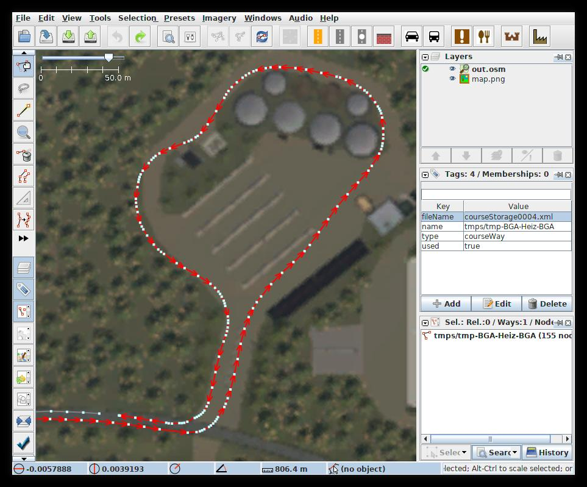
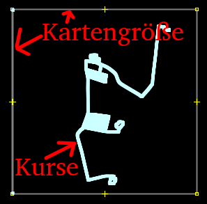

ENGLISH VERSION BELOW

Courseplay to OpenStreetMap (deutsch)
===========================
Um die gespeicherten Kurse aus Courseplay einfach bearbeiten zu können, konvertiert dieses Programm die
von Courseplay generierten XML Dateien in das Openstreetmap-Format, welches dann mit
[JOSM](https://josm.openstreetmap.de/) editiert werden kann:

Verwendung
----------
[Videotutorial von Gadarol auf YouTube](https://youtu.be/Cz7IJIzb3a8)

1. JAR-Datei herunterladen, speichern und ausführen.
2. `Course -> OSM` wählen und aus dem Courseplay-Ordner der gewünschten Map die `courseManager.xml` auswählen
3. Die Kartengröße in Meter Kantenlänge angeben (2048 für Normale- oder 4096 für Vierfachmaps). Der Wert wird später verwendet um
dabei zu helfen ein Hintergrundbild auszurichten.
4. Eine Datei wählen, in die geschrieben werden soll. Erzeugt wird eine einzelne OSM-Datei, die alle gespeicherten Kurse
enthält.
5. Den [Java OpenStreetMap Editor](https://josm.openstreetmap.de/) herunterladen.
6. Die in Schritt 4 generierte Datei öffnen. Zu sehen ist zum Beispiel:
    
    
7. Optional: Eine Hintergrundbild (map pda) hinterlegen, dazu:
    1. Unter Bearbeiten -> Einstellungen -> Plugins das Plugin "PicLayer" installieren
    2. Eine Zoomstufe einstellen, so dass die komplette Karte zu sehen ist (Zoomen mit Scrollrad, verschieben mit
    gedrückter rechter Maustaste). Dabei hilft das äußere Quadrat, welches die Kartengröße anzeigt   
    3. Im Menü über Hintergrundbilder -> Neue Bildebene aus Datei ein Bild von der Map laden  
    Ein Hintergrundbild der Map findest du wie folgt:  
        - **Originalmaps**: Im Installationsverzeichnis, z.B.: Steam\steamapps\common\Farming Simulator 19\sdk\maps\mapD\maps\pda_map_H.dds  
        - Bei **Modmaps**: In der .ZIP Datei der Mod unter \maps\pda_map_H.dds
         
         Diese .dds Datei einfach mit einem Grafikprogramm, z.B. Irfanview in .png umwandeln  
    4. Bei "Ebenen" oben rechts die Bildebene setzen (den weißen Haken im grünen Kreis auf die Bildebene setzen)
    5. Mit den Werkzeugen in der Leiste links die Karte passend verschieben. Dabei hilft wieder das äußere Quadrat.
    Siehe dazu auch [die Anleitung von PicLayer](https://wiki.openstreetmap.org/wiki/JOSM/Plugins/PicLayer).
8. Die Kurse nach belieben bearbeiten, Punkte verschieben oder löschen und danach speichern.
9. Im Konverter `OSM -> Course` wählen
10. Die gespeicherte OSM-Datei angeben
11. Ein Verzeichnis angeben, in dem die neuen Courseplay-Dateien gespeichert werden sollen. Achtung: Bestehende Dateien
    werden ohne Nachfrage überschrieben! Verwende ein leeres Verzeichnis oder erstelle vorher ein Backup.       

Spenden
-------
Dieses Programm ist kostenlos. Wenn es dir gefällt und du dich bedanken möchtest, kannst du mir jedoch eine Spende
zukommen lassen:

Courseplay to OpenStreetMap (english)
===========================
This program converts courses from the Courseplay format to the OpenStreetMap-Format, so that the courses can be edited
using [JOSM](https://josm.openstreetmap.de/).

Usage
-----
1. Download JAR-File from releases, and execute it.
2. Choose `Course -> OSM` and from the Courseplay-folder of the desired map, choose the file `courseManager.xml`.
3. Enter the size of the map in meters length of the edge. This will later be helpful when adding a background image.
4. Choose an output file. All courses will be written to this file.
5. Download the [Java OpenStreetMap Editor](https://josm.openstreetmap.de/).
6. Open the file generated in step 4. What you see is something like this: 
    
    
    The outer square represents the map size that you entered in step 3.
7. Optional: Add a background image (map pda):
    1. Go to Edit -> Preferences -> Plugins and install the plugin "PicLayer".
    2. Choose a zoom level, so that you can see the whole map (zoom using scroll wheel, move the map by holding right
    mouse button and moving the mouse.   
    3. In the menu Imagery -> Add picture layer from file add an image from the map.
    You can find an image as follows:
        - **Original maps**: In the install directory e.g., z.B.: Steam\steamapps\common\Farming Simulator 19\sdk\maps\mapD\maps\pda_map_H.dds  
        - **Mod maps**: In the .zip file of the mod with the path \maps\pda_map_H.dds
          
        Convert this .dds to .png using some image editor e.g. using Irfanview
    4. In the layers panel at the top right, move the white check mark in the green circle on the image layer.
    5. Use the toolbar on the left to adjust the map. See also the
    [manual of PicLayer](https://wiki.openstreetmap.org/wiki/JOSM/Plugins/PicLayer).
8. Edit the courses as desired, then save.
9. In the converter choose `OSM -> Course`
10. Choose the saved OSM-file
11. Choose a directory to save the output to. Any existing files are overwritten without confirmation. Choose an empty
   directory or create a backup of your files before.       

Donations
-------
This application is free of charge. If you like it and want to thank me, you can send me a donation:

